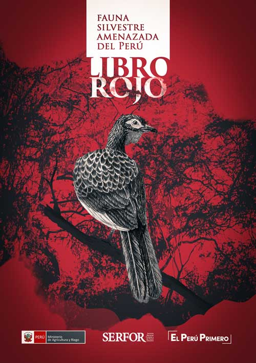
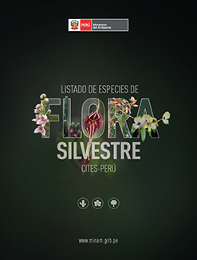

<!-- README.md is generated from README.Rmd. Please edit that file -->

```{r, include = FALSE}
knitr::opts_chunk$set(
  collapse = TRUE,
  comment = "#>",
  fig.path = "man/figures/README-",
  out.width = "100%"
)
```


# ffperu <a href='https://github.com/PaulESantos/ffperu'></a></a>

<!-- badges: start -->
[](https://lifecycle.r-lib.org/articles/stages.html#experimental)
[](https://CRAN.R-project.org/package=ffperu)
[](https://github.com/PaulESantos/ffperu/actions)
<!-- badges: end -->

The goal of ffperu it's making available the information included in the lists of wild flora and fauna protected by Peruvian legislation.

## Installation

You can install the released version of `ffperu` from [GitHub](https://github.com/) with:

``` r
remotes::install_github("PaulESantos/ffperu")
```
